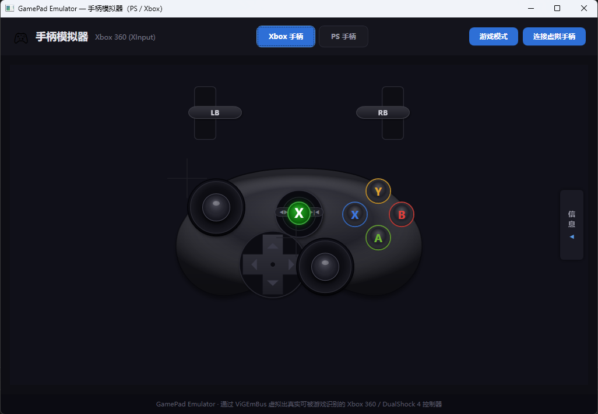
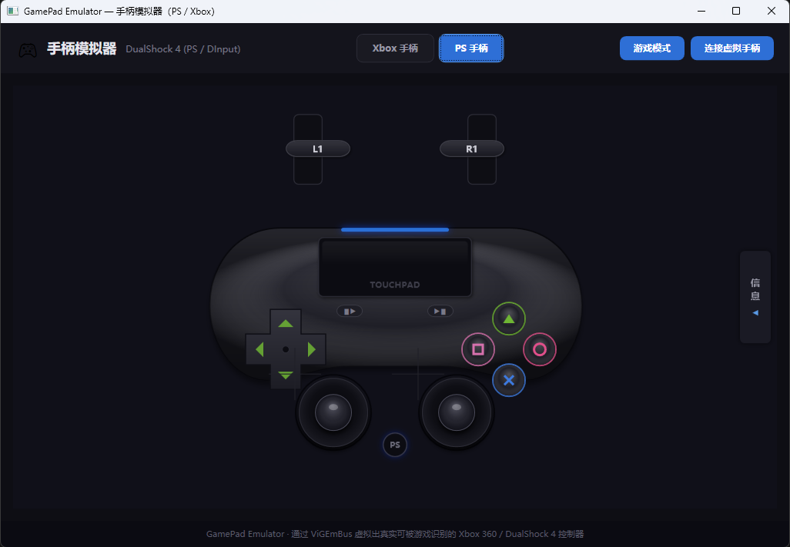

# GamePad Emulator — 手柄模拟器

在屏幕上模拟 **Xbox 360** / **PlayStation (DualShock 4)** 手柄，点击/拖拽画面即可向游戏注入真实输入。





## 使用

1. 顶部切换 Xbox / PS，点 **连接虚拟手柄**
2. 打开游戏，点 **游戏模式** —— 浮窗置顶且不抢焦点，照常操作手柄

> 需 Windows 10/11 x64，并安装 [ViGEmBus](https://github.com/ViGEm/ViGEmBus/releases/latest) 驱动（装后重启）。

## 构建与打包

```bash
dotnet build -c Release                      # 构建
pwsh tools/packaging/build-installer.ps1     # 打包成安装包（需 Inno Setup 6）
```

技术栈：C# / WPF (.NET 10) · [Nefarius.ViGEm.Client](https://github.com/ViGEm/ViGEm.Client)
